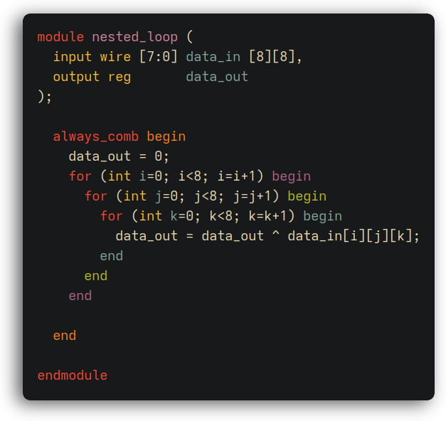

#+title: verilog-rainbow-mode.el

A minor mode for Emacs that colors Verilog =begin=/=end= keywords by
nesting depth, using the same face palette as [[https://github.com/Fanael/rainbow-delimiters][rainbow-delimiters]].

Requires Emacs 29.1+ and [[https://github.com/Fanael/rainbow-delimiters][rainbow-delimiters]].

** Usage

#+begin_src emacs-lisp
(add-hook 'verilog-mode-hook    #'verilog-rainbow-mode)
(add-hook 'verilog-ts-mode-hook #'verilog-rainbow-mode)
#+end_src

** Customization

Colors are controlled by =rainbow-delimiters-pick-face-function= and
the =rainbow-delimiters-depth-N-face= faces, the same ones used by
rainbow-delimiters for parentheses.

** Running Tests

#+begin_src sh
make all
#+end_src
